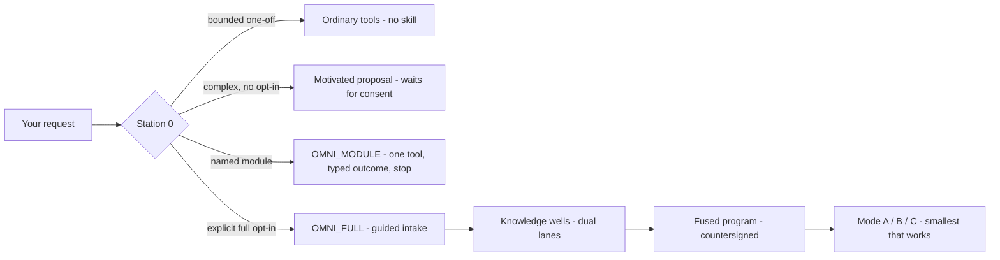

<p align="center">
  
</p>

<p align="center">
  <a href="https://github.com/ingcontartese-netizen/omni-builder-godmode/actions/workflows/validate.yml"></a>
  
  
  
  <a href="LICENSE"></a>
</p>

**The universal Agent Skill: it can build *anything* — a book, a codebase, a research dossier,
a business plan — because it gives your agent the two things context windows can't:
infinite memory and a team.**

🧠 **Infinite memory.** Every project lives in a *knowledge well* on disk — brains, ledgers,
frozen sources, receipts. Nothing dies when the context window ends: a session can crash,
restart, even rotate to a new agent, and the project picks up exactly where the bytes say it is.
This repo's own build survived multiple restarts that way.

👥 **The team.** GodMode gives every serious build two brains — a builder and an adversarial
verifier in separate lanes, double-signing every gate. Alone? You wear both hats in two
sessions. The verifier reproduces every claim from frozen bytes: no agent grades its own
homework.

🎯 **Universal by design.** The method is domain-agnostic: the same typed gates that governed
this codebase have been exercised on cookbook projects, tree-cultivation manuals and skill
forges. If it has an objective and produces artifacts, Omni-Builder can govern it.

And it **never activates on its own** — works with Claude Code, Codex, Antigravity, and any
host that speaks the open Agent Skills standard.

```bash
npx skills add ingcontartese-netizen/omni-builder-godmode
```

<details>
<summary>Manual install (any host, 30 seconds)</summary>

```bash
git clone https://github.com/ingcontartese-netizen/omni-builder-godmode.git
cp -r omni-builder-godmode/skills/skill-omni-builder-engineer-godmode-giuseppecontartese ~/.claude/skills/
```

Per-host targets (Codex, Antigravity) and verification commands: **[docs/INSTALL.md](docs/INSTALL.md)**.
</details>

---

## The problem

Anyone who has let an agent run a real project knows the failure modes:

> *It spun up five agents for a task that needed a shell script.*
> *It said "all tests pass" — and nobody, including the agent, could reproduce that claim.*
> *It quietly assumed consent, wrote files everywhere, and called it initiative.*
> *The protocol was so heavy that asking for a PDF triggered a project intake.*

Frameworks usually fix one of these by making another worse: more governance means more burden;
more freedom means less proof.

## The contract

Omni-Builder answers with a small set of **named, testable rules** — each one exists because a
real incident demanded it:

| # | Maxim | Meaning |
|---|-------|---------|
| 1 | **Measure the artifact, not your idea of it** | Count totals, state the counting method |
| 2 | **Silence is not consent; an error is not a verdict** | Interrupted verification is `INCONCLUSIVE` |
| 3 | **Read back before every retry** | Memory lives on disk — reread it, don't recreate it |
| 4 | **Never attack moving bytes** | Freeze, hash, verify, then recheck for drift |
| 5 | **A phase exists only with a state validator** | No typed gate, no phase |
| 6 | **An AI never opaque-spawns itself** | Successors come from the host or an authorized operator |
| 7 | **Observed incidents outrank hypothetical doctrine** | Each real defect becomes a rule + a fixture |
| 8 | **Maps age** | Re-derive state from the filesystem; log advancement separately from drift |

The golden invariant that holds it all together:

```
KNOWLEDGE_AVAILABLE  ≠  SKILL_INVOKED  ≠  EFFECT_AUTHORIZED
```

Knowing the method is free. Invoking the skill needs your explicit request.
And no invocation — none — grants effects: web, downloads, writes and autonomy each have
their own typed authority gate.

## Proportional activation — the parked truck

> *«Il tir resta parcheggiato — ma gli attrezzi si prestano a mano. La skill non è un forziere
> da proteggere: è un camion attrezzi a disposizione.»*
> — the design doctrine, in its original Italian: *the truck stays parked, but the tools are
> lent by hand. This skill is not a treasure chest to guard — it's a tool truck at your disposal.*

Ask for a bucket of water and you get a bucket — the truck's engine never starts on its own.

| Level | What you get | What it costs you |
|-------|--------------|-------------------|
| `OMNI_AWARE` | Method knowledge, advice, recommendations | Nothing — no files, no state, no ceremony |
| `OMNI_MODULE` | Exactly **one** packaged tool (e.g. the research module) | One consent, one mini-contract, typed outcome, stop |
| `OMNI_FULL` | The governed apparatus: guided intake, knowledge wells, dual-lane verification, gated execution | Explicit opt-in, then a guided intake that asks only high-leverage questions |



Complexity controls *recommendations*, never your eligibility: explicitly ask for the full
GodMode on a small project and you get it — the size of your project is your business.

## GodMode: the two hats

Every serious build gets **two brains**: a builder and an adversarial verifier, in two separate
native sessions with separate write lanes. Solo? You wear both hats — in two separate sessions,
with the weaker independence honestly declared. The verifier reproduces every claim from frozen
bytes: builder reports are never used as answer keys.

This isn't theory. **This repository was built under its own law**: two AI agents (builder and
verifier) under a human sovereign, four repair cycles, every gate double-signed, every defect
converted into a rule plus a regression fixture — the `fixtures/` folder ships the frozen
incidents, several of them earned by the verifier catching *itself*.

## The bounded research module

The most-requested tool ships as a standalone module — no project apparatus required:

```
KNOWLEDGE_RESEARCH_DOSSIER
  your material + a topic
  → material study → light web map → deep web research
  → provenance-bearing Markdown dossier → typed outcome → stop
```

Network access and downloads are separate, explicit grants. Deny the download and it degrades
honestly to `CAPTURE_MD_ONLY` — it never manufactures permission.

## What's inside

```
SKILL.md                 the protocol (Station 0 first)
references/  00–11       triage · roles · wells · knowledge · WBS · passes · proofs
                         autonomy · hosts · glossary · rotation · per-writer ledger
schemas/     32 typed    activation, intake, access envelopes, fused programs, leases…
scripts/     the organs  knowledge pipeline · program pipeline · operating regime
                         relay ledger · validators · sentinels
modules/                 KNOWLEDGE_RESEARCH_DOSSIER (packaged, self-contained)
tests/       226         positive suites plus mutant suites that prove the gates bite
fixtures/                real incidents frozen as regression cases
adapters/                per-host capability profiles (never copy conclusions across hosts)
```

Every number above is measured, not estimated — run the validator yourself:

```bash
cd skills/skill-omni-builder-engineer-godmode-giuseppecontartese
pip install -r requirements.txt   # PyYAML + jsonschema, used only by the validators
python -B scripts/validate_skill.py . --no-tests   # structure + doctrine pins
python -B -m unittest discover -s tests            # the full 226
```

## Security model, in one breath

Installing changes nothing. Loading grants nothing. Activation grants `METHOD_USE` only.
Web, download, project-write, execution and autonomy are separate typed authorities with
fail-closed gates — and the test suite includes the mutants that prove each gate bites.

## License

[Apache-2.0](LICENSE) © 2026 Giuseppe Contartese — built with the governed cooperation method
it teaches (*Metodo GC*).

**The team:** Giuseppe Contartese (sovereign PM) · **Codex** by OpenAI (builder — sole payload
writer, every freeze his) · **Claude** by Anthropic (adversarial verifier — every gate
countersigned). Two AI lanes, one human with the keys: exactly the topology this skill teaches.

<p align="center">
  <a href="https://www.star-history.com/#ingcontartese-netizen/omni-builder-godmode&Date">
    
  </a>
</p>

<p align="center"><i>The truck stays parked. The tools are lent by hand.</i></p>
